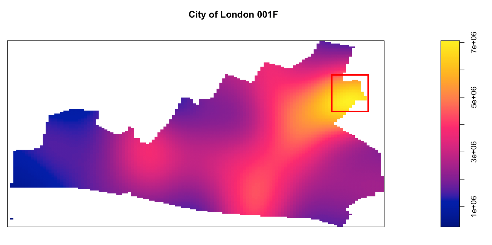
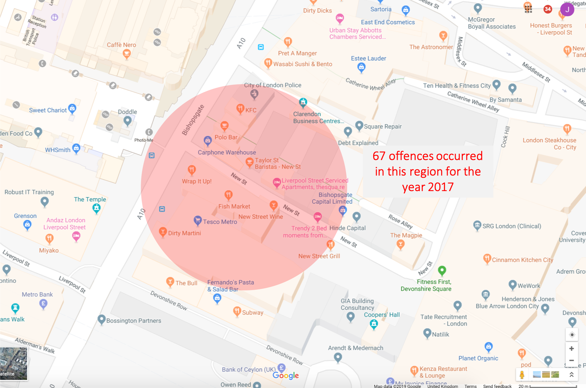

```{r setup, include=FALSE}
knitr::opts_chunk$set(echo=FALSE,
               cache=TRUE, autodep=TRUE, cache.comments=FALSE,
               message=FALSE, warning=FALSE)
setwd("~/Documents/UCL/Term_1/SAG/geo_project")
```

```{r}
# Load libraries
library(leaflet)
library(sp)
library(dplyr)
library(mapview)
library(ggplot2)
library(rgdal)
library(spgwr)
library(gstat)
library(spdep)
library(spatstat)
library(maptools)
library(tmaptools)
library(tmap)
library(rgeos)
library(geoR)
library(knitr)
library(osmar) 
library(geosphere)
```

```{r}
# load necessary data
load("boundaries/LondonLSOA")
load("boundaries/LondonWards")
projection <- CRS("+proj=longlat +ellps=WGS84 +datum=WGS84 +no_defs")
LondonWards <- spTransform(LondonWards, projection)
LondonLSOA <- spTransform(LondonLSOA, projection)
load("df.Rda") #crime df
```

# Exploratory Plots
```{r}
# Plot barplot of crime type
par(mar=c(15,6,4,1)+.1)
barplot(table(df$Crime.type), main='London Crimes', xlab='Crime Type',ylab='Count',las =2)

# Plot line chart crime x month
crime_count_by_month <-data.frame(table(df$Month, df$Crime.type)) 
names(crime_count_by_month) <- c("Month", "Crime.type","Freq")

ggplot(crime_count_by_month, aes(x = Month, y = Freq, colour = Crime.type, group=Crime.type), main='Crime Count by Type')+
  geom_line()+
  geom_point()+ 
  ggtitle("Crime Count in London")

# Plot line chart without ASB and Violence
crime_count_wo_ASB_V <- crime_count_by_month[!(crime_count_by_month$Crime.type=='Anti-social behaviour' |crime_count_by_month$Crime.type=='Violence and sexual offences'),]

ggplot(crime_count_wo_ASB_V, aes(x = Month, y = Freq, colour = Crime.type, group=Crime.type), main='Crime Count by Type')+
  geom_line()+
  geom_point()+ 
  ggtitle("Crime Count in London")

# Plot Mosaicplot
mosaicplot(main='Crime Proportions', table(df$Month, df$Crime.type))

```

# Get Crime Density Count Map By LSOA
```{r}
LondonLSOA_transformed <- LondonLSOA
# get crime count by LSOA
crimenum_by_LSOA <- data.frame(table(df$LSOA.name)) %>% na.omit()
crimenum_by_LSOA$Var1 <- as.character(crimenum_by_LSOA$Var1)
crimenum_by_LSOA <- crimenum_by_LSOA[!apply(crimenum_by_LSOA, 1, function(x) any(x=="")),] 

# get combined boundary + LSOA crime count data
LondonLSOA_transformed@data <- left_join(LondonLSOA_transformed@data, crimenum_by_LSOA, by=c("LSOA11NM"="Var1"))

# colour LSOA based on frequency values
pal <- colorNumeric(
  palette = "Blues",
  domain = LondonLSOA_transformed$Freq)
# colour LSOA based on colourquantiles
qpal <- colorQuantile("Blues", LondonLSOA_transformed$Freq, n = 5)
# colour LSOA based on bins
binpal <- colorBin("Blues", LondonLSOA_transformed$Freq, 3, pretty = TRUE)

# Plot crime map based on count density 
LSOA_crimemap <- leaflet(LondonLSOA_transformed, width = "100%")%>% 
  addProviderTiles(providers$CartoDB.Positron) %>% 
  setView(lng = -0.118092, lat = 51.509865, zoom = 9)%>%
  addPolygons(stroke = FALSE, smoothFactor = 0.2, fillOpacity = 1,
    color = ~qpal(Freq)) %>% 
  addPolygons(data=LondonLSOA_transformed, weight = 0.1, fillOpacity = 0,popup = paste("Region: ", LondonLSOA_transformed$LSOA11NM, "<br>",
                          "Value: ", LondonLSOA_transformed$Freq, "<br>")) %>% 
  addLegend(pal =qpal, values = LondonLSOA_transformed$Freq, opacity = 1, labFormat = function(type, cuts, p) {
    n = length(cuts)
    paste0(cuts[-n], " &ndash; ", cuts[-1])
  })

LSOA_crimemap
```

# Analysing Violence and Sexual Offences on a Regional Scale

```{r}
# Clean Data
vs_df <- subset(df, Crime.type == 'Violence and sexual offences')
vs_df <- vs_df[!is.na(vs_df$Longitude),]
vs_df <- vs_df[!is.na(vs_df$Latitude),]
vs_LSOA <- LondonLSOA
vs_num_by_LSOA <- data.frame(table(vs_df$LSOA.name)) %>% na.omit()
vs_num_by_LSOA$Var1 <- as.character(vs_num_by_LSOA$Var1)
vs_num_by_LSOA <- vs_num_by_LSOA[!apply(vs_num_by_LSOA, 1, function(x) any(x=="")),]
vs_LSOA@data<- left_join(vs_LSOA@data, vs_num_by_LSOA, by=c("LSOA11NM"="Var1"))
load("lsoa_census.Rda")
vs_census <-  vs_LSOA
vs_census@data <- left_join(vs_census@data, lsoa_census, by=c("LSOA11CD" = "Codes"))
vs_census$total_pop <- vs_census$X0.15 + vs_census$X16.29 + vs_census$X30.44 + vs_census$X45.64 + vs_census$X65.
vs_census$freq_pop <-  vs_census$Freq / vs_census$total_pop * 1000 #crime per 1000 people
```

By plotting the occurrence of violence and sexual offences per 1000 people on a chloropeth, we get the following map below:   
```{r}
tm_shape(vs_census) + 
  tm_polygons(col = 'freq_pop', 
              palette = 'Greens', 
              style = 'jenks', 
              n = 3, 
              border.col = 'transparent',
              title = 'VSO crime counts per 1000 residents',
              title.position = c("right", "bottom")
              ) 
```
This map shows us that VSO crimes are mainly concentrated in central london, with a few LSOAs having mid-range crime density dispersed across london. 

# Analysing Violence and Sexual Offences on a LSOA-level 
Ranking the LSOAs by crime density, we obtain the following rank table, showing the top 20 LSOAs with the highest crime rates (crime count per 1000 people): 
```{r}
top_20 <-  data.frame(vs_census@data[order(-vs_census$freq_pop)[1:20], "Names"])
#top_10_ <-  data.frame(vs_census@data[order(-vs_census$Freq)[1:20], "Names"])
top_20$freq_pop <- vs_census@data[order(-vs_census$freq_pop)[1:20], "freq_pop"]
colnames(top_20) <- c('LSOA name','Crime Rate')
kable(top_20, caption = '20 LSOAs with the highest crime rates')
```

We select the City of London 001F (COL001F) to do our analysis as it has the highest crime density.   

# Analysing Violence and Sexual Offences in City of London 001F
```{r}
######################## Clean data ###########################
COL001F_shp <- vs_LSOA[vs_LSOA$LSOA11NM == 'City of London 001F',]
COL001F_roads <- readOGR('boundaries/COL001F_roads/COL001F_roads.shp')
COL001F_ll <- vs_df[vs_df$LSOA.name == 'City of London 001F',]
COL001F_ll <- subset(COL001F_ll, select=c("Longitude", "Latitude"))
unique_COL001F_ll <- unique(COL001F_ll)
COL001F_ll <- jitterDupCoords(COL001F_ll, max = 0.0001)
points <- SpatialPoints(COL001F_ll)
unique_points <- SpatialPoints(unique_COL001F_ll)

# set crs
wgs <- '+proj=longlat +ellps=WGS84 +datum=WGS84 +no_defs +towgs84=0,0,0'
proj4string(points) <- CRS(wgs)
proj4string(unique_points) <- CRS(wgs)
COL001F_roads <- spTransform(COL001F_roads, CRS(wgs))

# get elements within LSOA boundary
roads <- gIntersection(COL001F_shp, COL001F_roads)
points <- gIntersection(COL001F_shp, points)
unique_points <- gIntersection(COL001F_shp, unique_points)

# manipulate data into suitable forms for buffering
for (i in 1:nrow(unique_points@coords)){
  rownames(unique_points@coords)[i] <- i
}
for (i in 1:nrow(points@coords)){
  rownames(points@coords)[i] <- i
}
```
By plotting the spatial distribution of the crimes on a map, we can make our first hypothesis:  
H1. VSO crimes are randomly distributed in the City of London 001F LSOA    
```{r}
## plot map of COL001F
tm_shape(roads)+
  tm_lines(col= 'grey', lwd=1.0)+ #
  tm_layout(legend.bg.color="white",
            title="Roads in City of London 001F",
            title.position = c("left", "top"), fontfamily = 'Arial') +
tm_shape(unique_points)+
  tm_dots(size = 0.1, col = 'red', alpha = 1)
```
   
```{r}
### Get ppp object
points_ll <-  data.frame(points@coords)
coordinates(points_ll) <- ~x+y
pts <- coordinates(points_ll)
COL001F_Owin <- as.owin(COL001F_shp)
COL001F_ppp <- ppp(pts[,1],pts[,2], window=COL001F_Owin)
```
To test for H1, we employ the use of quadrat counting.  In our case, as our area of interest is in the shape of the LSOA itself (not a regular shape), the quadrats are determined by dirichlet tessallation.      
```{r}
### test for homogeneity 
B <- dirichlet(COL001F_ppp)
qX <- quadratcount(COL001F_ppp, tess=B)
plot(COL001F_ppp, pch=16)
plot(qX, add = TRUE, lty=2, cex = 0, col = 'transparent') 
```
  
A chi-sq test  gives the following results:   
```{r}
qt <- quadrat.test(COL001F_ppp, tess = B)
qt
```
  
As the p-value is less than 0.05, it rejects the null hypothesis that the crimes are homogeneous.   

Next, we use the Kernel Density Estimation to visualise the different intensities of the VSO crime on the map.      
```{r}
COL001F_den <- density(COL001F_ppp)
plot(COL001F_den, main='City of London 001F')
```
From the map, clusters of VSO crime seem to occur North-East of City of London 001F. To understand why this is so, we can study the area in more detail (red box).    
  
The street level view reveals a hotspot of 67 VSO crimes in the region. 



Based on visual inspection alone, the offences seem to congregate around public entertainment outlets (orange markers above). Here, we construct a third hypothesis.   

H2: The location of VSO crimes correlate with the location of entertainment outlets.      

We define entertainment outlets here to be: restaurants, bars and pubs. With open street map, we can extract the locations of these outlets and visualise them on a map, alongside the VSO crimes:    
```{r}
# get COL001F osm data
COL001F_nodes_ways <- readRDS(file = "COL001F_nodes_ways.rds")

# create POIs
POIs_df <- data.frame()
POIs_category <- c('restaurant','pub', 'bar')
for (i in 1:length(POIs_category)){
  id <- find(COL001F_nodes_ways, node(tags(v == POIs_category[i])))
  poi <- subset(COL001F_nodes_ways, id)
  poi <- as_sp(poi, "points")
  poi <- spTransform(poi, wgs)
  poi <- gIntersection(poi, COL001F_shp)
  POIs_df <- rbind(POIs_df,poi@coords)
}
colnames(POIs_df) <- c('Longitude','Latitude')
POIs <-  SpatialPoints(POIs_df)
proj4string(POIs) <- wgs

# plot POIs against VSO crime locations

tm_shape(COL001F_shp)+
  tm_polygons(col= 'white', lwd=1.0)+ 
tm_shape(points)+
  tm_dots(size = 0.1, col = 'red', alpha = 1, title = 'VSO')+
tm_shape(POIs)+
  tm_dots(size = 0.1, col = 'blue', alpha = 1, title = 'Entertainment outlets')+
  tm_layout(
    title="VSO Crime & Entertainment Outlet Locations in London 001F",
    title.position = c("left", "top"),
    title.size = 0.8 ) +
tm_add_legend(
  type = c("fill"),
  labels = c('VSO crimes','Entertainment Outlets'),
  col = c('red','blue'))


```
Visually, the map seems to agree with our hypothesis. VSO crime locations seem to correlate with locations of entertainment outlets. We can perform an inhomogeneous kcross function to determine their spatial relationship.   

```{r}
##### prepare data for kcross #####
# create joint pubs_points df
POIs_type <- rep('POIs', nrow(POIs@coords))
points_type <- rep('crime', nrow(points@coords))
POIs_df <- data.frame(lat = POIs$Latitude, lng = POIs$Longitude ,type = POIs_type)
points_df <- data.frame(lat = points$y, lng = points$x ,type = points_type)
POIs_points <- rbind(POIs_df, points_df)

# create ppp object for joint pubs_points df
coordinates(POIs_points) <- ~lng+lat
pts <- coordinates(POIs_points)
POIspoints_ppp <- ppp(pts[,1],pts[,2], window=COL001F_Owin, marks = POIs_points$type)

# kcross test
kc <- Kcross.inhom(POIspoints_ppp, i ='POIs', j = 'crime')
plot(kc)
```
The inhomogeneous kcross function tells us that there is in fact, a repulsive spatial relationship between the location of VSO crimes and the location of entertainment outlets (lines below the blue line) -- VSO crimes do not cluster around entertainment outlets.  

Running a monte-carlo simulation tells us whether this observation is statistically significant:     
```{r}
Kcross.inhom_monte_carlo <- envelope(POIspoints_ppp, fun = Kcross.inhom, nsim =100, i = 'POIs', j = 'crime')
plot(Kcross.inhom_monte_carlo)
```
The observed *Kcrossinhom* line lies below and outside of the acceptance region. This means that the null hypothesis that the 2 variables are independent is rejected. The results also indicate a dispersive relationship between the 2 variables.   

This finding is surprising because we expected the 2 variables to be attractive. We may be able to explain this finding though, that the inhomogeneous Kcross function accounted for the the inhomogeneity in the spatial point pattern, brought about by private buildings and parks (random empty spaces on the map).   

So although the 2 variables seem to be occurring in the 'same place', they are in fact brought together because of the spatial structure of the environment. The presence of parks and buildings 'forces' the points to go along in a particular direction. This means if we plot other variables on the map as well (for example: other crimes or locations of supermarkets, etc.), their spatial locations may appear similar too -- avoiding the spaces that can't be occupied (parks, private spaces and buildings) and occupying the spaces that can be.     
Just out of curiosity, we can do simple tabulation of the number of VSO crimes that happen on the streets. 

```{r results = 'asis'}
### Clean data for buffer to work ####
tmerc <- "+proj=tmerc +lat_0=42.5 +lon_0=-72.5 +k=0.9999642857142857 +x_0=500000 +y_0=0 +datum=NAD83 +units=m +no_defs +ellps=GRS80 +towgs84=0,0,0"
points <- spTransform(points, CRS(tmerc))
roads <- spTransform(roads, CRS(tmerc))

buffered_points <- gBuffer(points, width = 5, byid=TRUE)

points_on_roads <- gIntersects(roads,buffered_points, byid=TRUE)
kable(table(points_on_roads), caption = 'Points on the streets')
```
`r round(table(points_on_roads)['TRUE']/sum(table(points_on_roads))*100)`% of VSO crimes happen on the streets.   

The repulsive relationship between VSO crimes and entertainment outlets (bars, pubs and restaurants) is still surprising though and we are uncertain why this is so. Perhaps these are places people usually go to with a group of friends of family and hence it is more difficult for perpatrators to commit VSOs? These are also places with high visibility therefore perpatrators do not dare to commit VSOs? VSOs at bars and pubs are also likely to go unreported, because of the nature of their environments? Or perhaps it could be because of a related variable that causes this repulsive relationship. Clearly, more analysis and research is needed in this area. 

```{r}

#### Just Hillingdon 031A #### 
H031A_shp <- vs_LSOA[vs_LSOA$LSOA11NM == 'Hillingdon 031A',] 
H031A_ll <- vs_df[vs_df$LSOA.name == 'Hillingdon 031A',] 
H031A_ll <- subset(H031A_ll, select=c("Longitude", "Latitude"))

H031A_map <- leaflet(H031A_ll) %>% 
  addProviderTiles(providers$CartoDB.Positron) %>% 
  addCircleMarkers(radius = 1, color = 'blue') %>%  
  addPolygons(data = H031A_shp, weight = 1) 

H031A_map 
  
```


<!-- ``` -->


<!-- ## plot points of occurrence -->
<!-- H031A_points <- SpatialPoints(H031A_ll) -->
<!-- plot(H031A_shp) -->
<!-- plot(H031A_points, add= TRUE , col = 'red', pch = 16) -->

<!-- # plot kernel density plot  -->
<!-- H031A_latlong <- H031A_ll -->
<!-- coordinates(H031A_latlong) <- ~Longitude+Latitude -->
<!-- H031A_pts <- coordinates(H031A_latlong) -->
<!-- H031A_Owin <- as.owin(H031A_shp) -->
<!-- H031A_ppp <- ppp(H031A_pts[,1],H031A_pts[,2], window=H031A_Owin) -->
<!-- H031A_den <- density(H031A_ppp) -->
<!-- plot(H031A_den, main='Hillingdon 031A') -->
<!-- ``` -->


<!-- ### Analysing Factors that Contribute to VSO -->
<!-- ```{r} -->
<!-- ### Clean census data -->
<!-- #https://data.london.gov.uk/dataset/lsoa-atlas -->
<!-- # lsoa_census <- read.csv('data/lsoa_data_edited.csv') -->
<!-- # lsoa_census$house_price <- as.numeric(lsoa_census$house_price) -->
<!-- # lsoa_census_2 <- read.csv('data/lsoa_data_edited_2.csv') -->
<!-- # lsoa_census <- left_join(lsoa_census, lsoa_census_2, by=c("Codes"="Codes", -->
<!-- #                                                           "Names" = "Names")) -->
<!-- # save(lsoa_census,file="lsoa_census.Rda") -->
<!-- load("lsoa_census.Rda") -->
<!-- vs_census <-  vs_LSOA -->
<!-- vs_census@data <- left_join(vs_census@data, lsoa_census, by=c("LSOA11CD" = "Codes")) -->
<!-- vs_census.W <- nb2listw(poly2nb(vs_census)) -->

<!-- # run durbin model -->
<!-- vs.durbin <- lagsarlm(Freq ~ X0.15 + X16.29 + X30.44 + X45.64 + X65. + Working.age + person_per_hectare + couple_w_children + white + uk_born + household_no_english + Christian + Buddhist + Hindu + Jewish + Muslim + Sikh + other_religion + no_religion + owned_outright + social_rented + private_rented + household_at_least_one_usual_resident + household_no_usual_resident + whole_house + apartment + house_price + unemployment_rate + bad_health + no_cars_in_household + poor_transport_access + household_income, data = vs_census@data, listw = vs_census.W, type = 'mixed') -->

<!-- summary(vs.durbin) -->
<!-- ``` -->
<!-- **Here are the results** -->
<!-- Significant and negatively correlated:   -->
<!-- X0.15, X16.29, X45.64, X65, person_per_hectare, owned_outright, household_at_least_one_usual_resident, apartment, poor_transport_access                     -->

<!-- Significant and positively correlated:   -->
<!-- Christian, Buddhist, Hindu, Jewish, Muslim, no_religion, private-rented, household_no_usual_resident, unemployment_rate , no_cars_in_household , household_income                                          -->
<!-- ### Extra code below  -->

<!-- res_net <- google_places(location = c(51.513841,-0.088650), -->
<!--               place_type = "restaurant", -->
<!--               radius = 20000, -->
<!--               key = api_key) -->
<!-- #### Get COL001F roads shapefile #### -->
<!-- # library('osmar') -->
<!-- # library('geosphere') -->
<!-- # london.box <- center_bbox(center_lon = -0.090074, center_lat = 51.515190, width =  1900, height = 1900) -->
<!-- # api <- osmsource_api(url = "https://api.openstreetmap.org/api/0.6/") -->
<!-- # london <- get_osm(london.box, source = api) -->
<!-- # ways <- find(london, way(tags(k == "highway"))) -->
<!-- # ways <- find_down(london, way(ways)) -->
<!-- # ways <- subset(london, ids = ways) -->
<!-- # hw_lines <- as_sp(ways, "lines")   -->
<!-- # raster::shapefile(hw_lines,'COL001F_roads.shp') -->
<!-- # spplot(hw_lines, zcol = "uid") -->
<!-- # mapview(hw_lines)  -->

<!-- Plotting VSO by LSOA, we get the following map:   -->
<!-- ```{r} -->
<!-- # Plot map -->
<!-- cc_colors <- c('#FFE80C','#FF7700','#E81501') -->
<!-- cc_pal <- colorBin( -->
<!--   palette = cc_colors, -->
<!--   bins = c(0,10,100,2000), -->
<!--   na.color='black') -->

<!-- pop_up_text = paste("Region: ", vs_LSOA$LSOA11NM, "<br>", -->
<!--                           "Value: ", vs_LSOA$Freq, "<br>") -->

<!-- vs_LSOA_map <- leaflet(vs_LSOA) %>% -->
<!--   addProviderTiles(providers$CartoDB.Positron) %>% -->
<!--   setView(lng = -0.118092, lat = 51.509865, zoom = 9)%>% -->
<!--   addPolygons(stroke = FALSE, smoothFactor = 0.2, fillOpacity = 1, -->
<!--     color = ~cc_pal(Freq), popup = pop_up_text) %>%  -->
<!--   addLegend("bottomright",  -->
<!--     colors= cc_colors,  -->
<!--     labels=c('0-10', "10-100","100-2000"), -->
<!--     opacity= 1) -->

<!-- vs_LSOA_map -->
<!-- ``` -->


<!-- ### Violence and Sexual Offences   -->
<!-- Violence and sexual offences (VSO) crime is chosen as it is one of the more severe crimes that bring about damage to people and property. Violence includes murder, kidnap, etc hence the level of severity of this nature of crime can be high. We want to understand more about these types of crimes in order to help understand and possibly predict the factors that contribute to this crime type.    -->

<!-- ```{r} -->
<!-- # Get violence and sexual offences crimes only -->
<!-- vs_df <- subset(df, Crime.type == 'Violence and sexual offences') -->
<!-- vs_df <- vs_df[!is.na(vs_df$Longitude),] -->
<!-- vs_df <- vs_df[!is.na(vs_df$Latitude),] -->
<!-- ``` -->

<!-- If we plot a year's worth of VSO on a map, we would get the following result:    -->
<!-- ```{r} -->
<!-- # Violence and Sexual Offences Map  -->
<!-- vs_dot_map <- leaflet(vs_df) %>%  -->
<!--     addProviderTiles(providers$CartoDB.Positron) %>% -->
<!--   setView(lng = -0.118092, lat = 51.509865, zoom = 9)%>% -->
<!--   addCircleMarkers(radius =1, color = 'red', stroke = FALSE, fillOpacity = 0.5) -->

<!-- vs_dot_map -->

<!-- ``` -->
<!-- This map is not very helpful in telling us much information about the crime nature. Hence, we employ some methods in point pattern analysis to help us understand more.  -->

<!-- ### Point Pattern Analysis -->
<!-- ```{r} -->
<!-- # get ppp file -->
<!-- london_shape <- readOGR('boundaries/greaterlondon.geojson') -->
<!-- vs_spatial_points <-  vs_df -->
<!-- coordinates(vs_spatial_points) <- ~Longitude+Latitude -->
<!-- pts <- coordinates(vs_spatial_points) -->
<!-- londonOwin <- as.owin(london_shape) -->
<!-- vs_ppp <- ppp(pts[,1],pts[,2], window=londonOwin) -->

<!-- # ggplot(data=vs_LSOA@data, aes(vs_LSOA$Freq)) + geom_histogram() + ggtitle('Violence and Sexual Assault Crimes in 2017') + ylab('Number of LSOAs') + xlab('Violence and Sexual Offences Occurrence') -->
<!-- ``` -->

<!-- Looking at the density plot below, we see that VSO is the most dense in the central part of London. -->
<!-- ```{r} -->
<!-- # density plot -->
<!-- ds <- density(vs_ppp) -->
<!-- plot(ds, main='Violence and Sexual Offences') -->
<!-- ``` -->

<!-- To test for spatial clustering, we run ripley's K function and it indicates that there is a high level of clustering for VSO.  -->
<!-- ```{r} -->
<!-- # ripley's k function -->
<!-- ktest <- Kest(vs_ppp) -->
<!-- plot(ktest) -->
<!-- ``` -->

<!-- However, this result is not very helpful. The sheer number of cases in central london as compared to everywhere else, skews ripley's K function -- there is clustering and the clustering happens in central london.    -->

<!-- We could perhaps analyse VSO by LSOAs to ensure that the crime density is contained.  -->


<!-- ### Map pubs in london -->
<!-- ```{r} -->
<!-- library("raster") -->
<!-- library("sp") -->
<!-- pubs <- readOGR("data/pubs.geojson", "OGRGeoJSON",require_geomType="wkbPoint") -->
<!-- pubs <- spTransform(pubs, CRS("+proj=longlat +ellps=WGS84 +datum=WGS84 +no_defs +towgs84=0,0,0")) -->

<!-- plot(LondonLSOA) -->
<!-- plot(pubs, col="red" , add=TRUE) -->
<!-- l <- LondonLSOA -->
<!-- l@data <- subset(l@data,select=c('LSOA11NM')) -->
<!-- res <- sp::over(pubs, l) -->

<!-- res <- poly.counts(pubs,LondonLSOA) -->
<!-- setNames(res, LondonLSOA@data$lala) -->

<!-- pubs <- readOGR("data/pubs.geojson", "OGRGeoJSON",require_geomType="wkbPoint") -->
<!-- map <- leaflet() %>% -->
<!--   addProviderTiles(providers$CartoDB.Positron, group = "Base") %>% -->
<!--   addCircleMarkers( -->
<!--     data = pubs, -->
<!--     radius = 1, -->
<!--     color = "red", -->
<!--     stroke = TRUE, fillOpacity = 1) -->

<!-- map -->
<!-- ``` -->
<!--  -->

<!-- ### Create Maps for GIF -->
<!-- ```{r} -->
<!-- months <- c("2017-01","2017-02","2017-03","2017-04","2017-05","2017-06","2017-07","2017-08","2017-09","2017-10","2017-11","2017-12") -->

<!-- crime_types <- unique(df$Crime.type) -->

<!-- for (crime_type in crime_types){ -->
<!--   for (month in months){ -->
<!--   single_crime_df <- subset(df, Crime.type == crime_type & Month == month) -->
<!--   single_crime_map <- leaflet(single_crime_df, width = "100%")%>% -->
<!--   addProviderTiles(providers$CartoDB.Positron) %>% -->
<!--   setView(lng = -0.118092, lat = 51.509865, zoom = 9)%>% -->
<!--   addCircleMarkers(radius =1, color = 'red', stroke = FALSE, fillOpacity = 0.5) %>% -->
<!--   addLabelOnlyMarkers(lng = -0.5, lat = 51.7, label = month, -->
<!--                       labelOptions = labelOptions(noHide = T, textOnly = T,style = list( -->
<!--         "color" = "black", -->
<!--         "font-family" = "source sans pro", -->
<!--         "font-style" = "bold", -->
<!--         "font-size" = "20px", -->
<!--         "border-color" = "rgba(0,0,0,0.5)" -->
<!--       ))) -->
<!--   path <- sprintf("/GIFs/%s/%s_%s.png", crime_type, crime_type,month) -->
<!--   print(path) -->
<!--   mapshot(single_crime_map, file = paste0(getwd(), path, sep="")) -->
<!-- } -->
<!-- } -->

<!-- ``` -->

<!-- ### Create GIFs -->
<!-- ```{r} -->

<!-- library(purrr) -->
<!-- library(magick) -->

<!-- crime_types <- unique(df$Crime.type) -->

<!-- for (crime_type in crime_types){ -->
<!--   file_path = paste0(getwd(), sprintf("/GIFs/%s", crime_type), sep="") -->
<!--   list.files(path = file_path, pattern = "*.png", full.names = T) %>% -->
<!--     map(image_read) %>% # reads each path file -->
<!--     image_join() %>% # joins image -->
<!--     image_animate(fps=2) %>% # animates, can opt for number of loops -->
<!--     image_write(sprintf("%s.gif",crime_type)) # write to current dir -->
<!-- } -->

<!-- ``` -->


<!-- ### Clean Data -->
<!-- ```{r} -->
<!-- # Load crime and boundary data -->
<!-- COL_data <- read.csv(file=paste(getwd(),'/data/COL_street.csv',sep=''), header=TRUE, sep="\t") -->
<!-- metro_data <- read.csv(file=paste(getwd(),'/data/metro_street.csv',sep=''), header=TRUE, sep="\t") -->
<!-- data <- rbind(COL_data, metro_data) -->
<!-- load("boundaries/LondonLSOA") -->
<!-- load("boundaries/LondonWards") -->
<!-- projection <- CRS("+proj=longlat +ellps=WGS84 +datum=WGS84 +no_defs") -->
<!-- LondonWards <- spTransform(LondonWards, projection) -->
<!-- LondonLSOA <- spTransform(LondonLSOA, projection) -->

<!-- # get crime df -->
<!-- df <- subset(data, select=c("Crime.type", "LSOA.name","Longitude","Latitude","Month")) -->
<!-- save(df,file="df.Rda") -->
<!-- ``` -->
